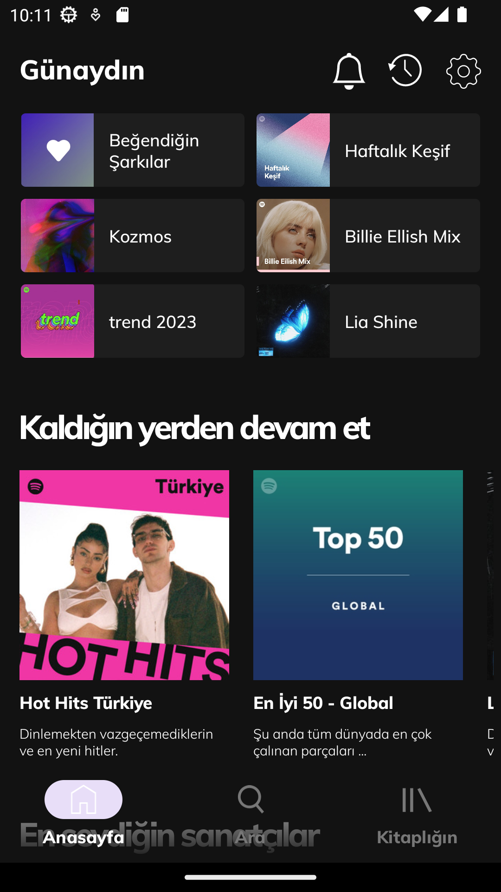

# SpotifyUIClonewithKotlin

## Project Description

This project is developed in Kotlin programming language to clone the user interface of Spotify music streaming service. 
In this project, i utilized the following components and elements:

* RecyclerView: RecyclerView was used to display dynamic and repeating list items.It was employed to organize and list the cards within the project.
* Adapter: I created a custom CardAdapter class that extended RecyclerView.Adapter. This adapter was responsible for managing and updating the content of the cards displayed in the RecyclerView.
* Card Design: Each card in the project represents a custom Card Design element. It consists of various components, such as card title, description, and an image.

## Prerequisites

- Android Studio (or whatever you prefer for Android Dev. IDE)
- Kotlin

## Installation

1. Clone this repository.
2. Open Android Studio.
3. Click on "Open an existing Android Studio project" from the file menu and select the cloned directory.
4. Start an emulator or connect an Android device. (I prefer Pixel 2)
5. Click on "Run" button to run the application.

  - Upon launching the app, a Spotify-like home screen will be displayed.

## Screenshots

---

